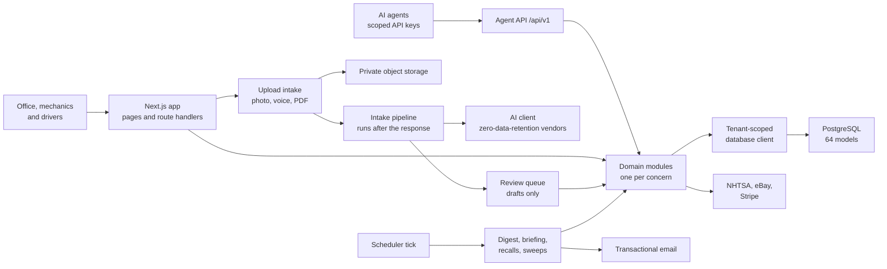

# FleetHarbor

**Fleet maintenance for trade contractors: every truck's service, fuel and cost in one place, with AI that turns a photographed invoice or a spoken note into a record a person approves.**

Live: [fleetharbor.us](https://fleetharbor.us)

---

## What it is

FleetHarbor is a multi-tenant web app for commercial trade contractors (HVAC, plumbing, electrical) who run a fleet of service vans and trucks. It tracks each vehicle's service history, maintenance schedules, drivers, fuel and running cost. It tells the office which trucks are due, which are costing too much, and which have open safety recalls.

The paperwork is the hard part, so the app takes it the way it actually arrives. A manager photographs a shop invoice, drops in a fuel-card statement PDF, or speaks a note from the cab. A model reads it into a draft, and a person checks the draft before anything is written to the vehicle's record.

FleetHarbor is Emergent's own product. Its first customer is [Kelleher HVAC](https://github.com/codeslayer44/kelleher-hvac-showcase), a Richmond, Virginia contractor whose fleet of about 30 trucks moved onto FleetHarbor in August 2026 from the fleet module of its operations platform. Kelleher's office runs the fleet on it today.

## Highlights

- **Paperwork in, reviewed records out.** Photos, voice notes and PDFs (invoices, shop bills and multi-page fuel-card statements) become structured drafts with line items, vendor, odometer and the matched vehicle. Each draft lands in a review queue with its warnings: a likely duplicate, totals that don't add up, an odometer reading lower than the last one. The model never writes to the ledger itself.
- **A second, independent reader for fuel statements.** Born-digital PDFs are read from their text layer page by page, with a vision fallback for scans. Deterministic code then checks that the model's rows add up to the totals the statement itself prints. A 24-page statement with 117 purchases reconciles to the cent and the gallon.
- **Maintenance that knows what it doesn't know.** Schedules run on miles or months, whichever comes first. They can be researched from the manufacturer's published schedule and applied in one tap. A schedule with no usable odometer reads "unknown", never a guessed date. A nightly digest and a per-mechanic morning briefing come out of the same due calculation.
- **Honest fuel and cost numbers.** Tank-to-tank MPG returns a blank with a reason rather than an implausible number. Cost per mile comes in three versions (maintenance, fuel, all-in), always with the mileage it was divided by. Repair-or-replace verdicts are deterministic, and four PDF reports (State of the Fleet, vehicle history, cost by date range, PM and compliance due) render server-side.
- **Shop tools for fleets with their own mechanics.** Work orders with time clocks, callback detection, a job planner that lays out a repair as operations, minutes and parts and prices it from a disclosed labor-rate ladder, a parts catalog filled from invoices, part-number search with cited sources, live eBay listings for a part number, and a public job board for posting overflow work. The job board never shows a unit number, plate, VIN or street address.
- **An API built for AI agents.** `/api/v1` exposes 47 paths and 57 operations behind per-key scopes and role ceilings. Writes carry idempotency keys, revisions and `If-Match`, there is an org-scoped change feed, and records written through it are marked "via agent". The app's own screens and the API call the same library functions, so both enforce the same rules.
- **An in-app assistant with the reader's permissions.** "Ask FleetHarbor" answers questions from the fleet's own records, links straight to the right page and takes dictation. It sees exactly what the signed-in person can see: a technician never gets a dollar figure from it.

## The brief and the outcome

**What Kelleher needed.** A commercial HVAC contractor's fleet book was a spreadsheet of trucks and plates. Service history arrived as paper shop invoices, fuel arrived as multi-page fuel-card statements, and keeping maintenance current meant someone retyping all of it.

**What Emergent delivered.** FleetHarbor, built as a product any contractor can sign up for, with Kelleher's fleet imported in full: vehicles, drivers and assignments, vehicle illustrations, and 87 maintenance templates with 235 schedules. Kelleher's paperwork now goes in by photo, PDF or voice. Its monthly fuel-card statements are read page by page and reconciled against their printed totals. FleetHarbor also includes an in-house mechanic workflow (work orders, time clocks, pick lists, job sheets), ready for the repairs Kelleher does itself.

**What it changed.** The office gets one fleet-wide answer to "how far behind is maintenance" (trucks current, jobs in the backlog, estimated hours), each truck's cost per mile, and NHTSA recall campaigns matched to each truck's model. As its mechanics come onto the system, a morning briefing will lay out each mechanic's day. The same system is now open to other contractors on a 30-day trial.

## Architecture

Every request comes in through a thin page or route and lands in a domain module (`maintenance`, `fuel`, `costs`, `intake-commit`, `work-orders` and over a hundred others), and every tenant read and write goes through one database client that scopes it to the caller's organization. Uploads are stored and answered immediately. The AI read happens after the response, and the queue page shows its progress ("Reading page 7 of 24"). The read produces a draft and nothing else. Committing a draft is a separate step, triggered by a person through the same function the agent API's "accept" calls.

A scheduler hits one authenticated endpoint on a fixed tick. It recomputes due dates in each organization's own timezone, sends the morning digest and each org's briefing at its chosen time, checks recalls, and sweeps up AI work a restart left stranded. A run lock means two overlapping ticks can never send the same email twice.

The deeper walk-through is in [docs/architecture.md](docs/architecture.md).

## Engineering notes

**Tenancy is structural, not a habit.** The worst bug a multi-tenant app can have is one query that forgets the organization filter. FleetHarbor doesn't rely on people remembering it. Tenant code gets its database client from a single factory that adds the caller's organization to every read and checks it on every write, for an explicit list of org-scoped models. A dedicated isolation suite attempts cross-organization reads and writes against those models and fails the deploy if any succeed. Background jobs have no session, so they rebuild their tenant context from the stored job row, never from anything a caller sent.

**The model proposes, a person commits, and the commit claims first.** Two managers reviewing the same queue on two phones is a real situation. So committing a draft first moves the job from "needs review" to "committed" in a conditional update, and only then creates the record, rolling back if that fails. The losing tap sees "committed by someone else" instead of creating a duplicate. The draft is re-validated at commit time, and the duplicate check runs again against the ledger as it stands now. There is one deliberate exception: a paid bill a manager drops on a truck's own page files itself, but only when the read is clean. Any blocker, a missing amount, an exact duplicate or a failed plausibility check sends it back to the queue with the reason written at the top.

**Two readers for every fuel statement.** When the model types out a hundred rows of digits, the danger is a row that is quietly wrong or missing. So a deterministic parser reads the same page independently. It finds the statement's own printed totals and checks that the model's rows add up to them. The parser is a checker, not a second extractor: its rows never reach the draft, and it never fills in a value it can't prove (a date whose year the statement period doesn't settle stays blank). When the pipeline was upgraded, a re-read of one of Kelleher's real statements reconciled exactly and showed that an earlier read had skipped one page's four purchases. They were restored with an audit entry recording what was added and why.

**A wrong number is worse than a blank one.** This runs through the whole product. MPG is computed fill to fill, with this fill's gallons over the miles since the last one, inside plausibility and distance bands that catch a transposed odometer digit. Anything ambiguous returns no number and a machine-readable reason. Due dates are calendar dates compared in the organization's timezone, never millisecond differences that drift a day across daylight saving. NHTSA lists recalls by model name, and an exact-match miss looks exactly like "no recalls". So a vehicle whose name nothing recognizes reads "unchecked", never "recall-free".

**One record, two doors.** The agent API isn't a second implementation. Issue triage, intake accept and reject, service-record edits and work-order changes were moved out of the UI routes into library functions that both the screens and `/api/v1` call. Idempotency claims a row before writing, and a reused key with a different payload is a conflict, never a second write. Revisions catch an agent acting on stale data. Role ceilings cap what any key can do, so an agent working for a technician sees work and hours but no money, exactly like the technician does.

## Tech stack

| Layer | Technology |
|---|---|
| App | Next.js 16 (App Router, standalone output), React 19, TypeScript (strict) |
| Data | PostgreSQL, Prisma 7, 53 SQL migrations, tenant scoping via a Prisma client extension |
| Auth | Better Auth (email and password, magic links, email verification), four roles: viewer, tech, manager, owner |
| AI | xAI, Fireworks and OpenRouter behind one client, all zero-data-retention; model per task chosen in platform settings; per-org daily AI spending limit |
| Documents | `pdfjs-dist` (text layer and embedded-image extraction), `sharp` (paperwork to grayscale WebP), `@react-pdf/renderer` (reports, job sheets), ExcelJS (spreadsheet import with AI column mapping) |
| Integrations | NHTSA vPIC (VIN decode) and recalls, eBay Browse (part listings), Stripe (subscriptions, billing portal), Resend (email with an audit log) |
| UI | Tailwind CSS v4, custom primitives, Lucide icons, Source Serif 4 / Inter / IBM Plex Mono |
| Hosting | [HostKit](https://github.com/codeslayer44/hostkit-showcase), Emergent's in-house hosting platform |
| Verification | 60 `verify:*` suites run against a real database, plus a strict typecheck, before every deploy |

## By the numbers

| | |
|---|---|
| Commits | 339 (2026-07-25 to 2026-10-06) |
| Source lines | 178,558 |
| Tracked files | 1,057 |
| SQL migrations | 53 |
| Database models | 64 |
| Agent API | 47 paths, 57 operations |
| Verification suites | 60 |
| Languages | TypeScript 98.1% |

**On testing.** FleetHarbor doesn't use a unit-test framework, so a count of `*.test.ts` files reads as almost zero. Its tests are verification suites: standalone scripts, one per feature area, that run against a real PostgreSQL database and assert behavior clause by clause. Counted in the repo: 60 `verify:*` commands in `package.json`, backed by 66 verification scripts. The recorded assertion counts for 54 of those suites add up to about 7,200, including 1,343 for the agent API and 406 for AI intake. The intake suite stubs the network, so it never calls an AI vendor. All of the suites must pass before a deploy.

## About this repo

FleetHarbor's source code is private. This repository documents what was built and how it works, and contains no source code from the product.

Built by [Emergent AI Agency](https://emergentaiagency.com) (Ryan Chappell). FleetHarbor is Emergent's own product, built from a client's real fleet and run in production on Emergent's [HostKit](https://github.com/codeslayer44/hostkit-showcase) platform. To talk about a project, get in touch through [emergentaiagency.com](https://emergentaiagency.com).
