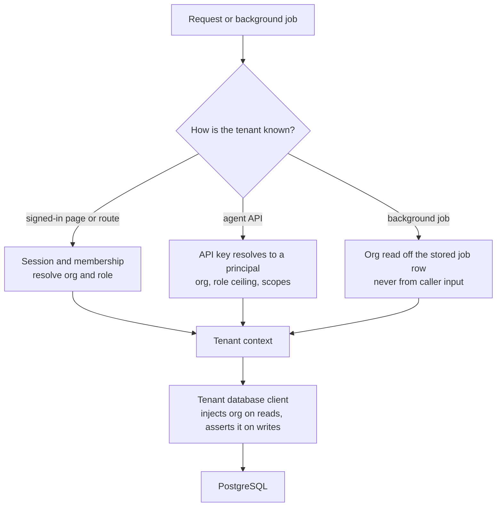
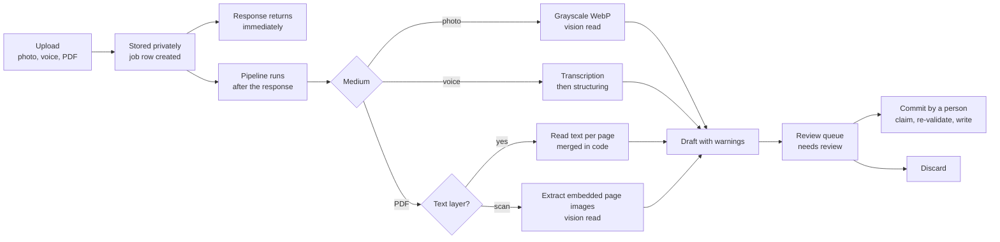
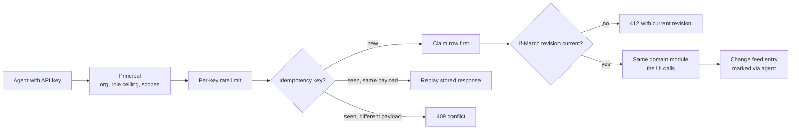

# FleetHarbor: architecture

This document goes one level deeper than the [README](../README.md): how tenancy is enforced, how a photograph becomes a service record, how the maintenance and cost numbers are computed, and how the agent API shares rules with the app. Snippets are illustrative shapes rewritten for this page, not product code.

## Design principles

1. **Tenancy is enforced by the database client, not by remembering a filter.** There is one way for tenant code to reach org-scoped data, and it scopes every query.
2. **AI produces drafts. People produce records.** No model output reaches the ledger without a person (or, through the API, a person's agent relaying an approval) committing it. The one exception is narrow, and it is described below.
3. **A blank with a reason beats a wrong number.** MPG, due dates, cost per mile, recalls and repair-or-replace verdicts all have an explicit "can't tell" state, and the UI shows it as such.
4. **One record, one implementation.** The screens, the agent API, the in-app assistant and the scheduler call the same domain modules. Pages and routes stay thin.
5. **Money is integer cents and dates are calendar dates.** Dollars are formatted in one place. Calendar dates are compared as `yyyy-MM-dd` strings in the organization's timezone, never as millisecond differences.

## 1. Tenancy and roles



Every org-scoped model (vehicles, fleets, service records, fuel purchases, intake jobs, work orders, estimates, parts and about forty more) is on an explicit allowlist. The tenant client wraps Prisma: it adds the caller's organization to every read on those models and refuses a write whose organization doesn't match. Nested writes aren't rewritten by the extension, so code that creates children inline sets the organization on each child explicitly, through a helper made for it. A cross-tenant isolation suite exercises those models directly. The intentionally cross-tenant platform console uses the raw client and sits behind a platform-admin check.

Roles are ranked `viewer < tech < manager < owner`, and gates compare rank rather than listing roles. Cost visibility is its own permission: technicians see work, hours and parts, never dollars. That rule holds on the pages, in the API serializers, in the assistant's tools and in the job sheet's defaults. A "driver" isn't a separate role. It is a member at `tech` or above linked to a driver row, which unlocks the one-button `/drive` mini-app.

## 2. Intake: paperwork to a reviewed record



**Off the request path.** An upload route stores the bytes, creates the job and answers. The read runs afterwards, and the queue page is the progress indicator. Someone at a parts counter can photograph an invoice and put the phone away. A job moves through `uploaded`, `processing`, `needs_review`, then `committed` or `discarded`. Every failure ends in `failed` with a message a person can read, and "Read it again" re-runs the stored file. A sweep finds jobs a restart left half-read and recovers them, so nothing sits on "Reading..." forever.

**PDFs are read the way they were made.** A born-digital PDF is read from its text layer page by page, in display order even on rotated pages, because those characters are exact. A scanned PDF has its embedded page images extracted (never re-rendered) and sent through the vision path. A malformed page output gets one reshape-only repair pass, and the draft says so.

**The draft carries its doubts.** Line items, vendor, date, odometer, totals and the matched vehicle come with warnings attached. Those cover a likely or exact duplicate, line items that don't sum to the total, an odometer lower than the vehicle's last reading, an odd date, a low-confidence read, and how the vehicle was matched (unit number, plate, VIN or the page the bill was dropped on). The raw model output is kept on the job for re-parsing and debugging.

**Committing is claim-first.** The job's status changes from `needs_review` to `committed` in a conditional update before any record is created, and the change rolls back if creation fails. That way two reviewers can't produce two records. The draft is parsed and validated again, blockers refuse an incomplete one, a service with no amount needs an explicit "save without an amount" confirmation, and the duplicate check runs again against the current ledger. Every record keeps its origin (`photo_ai`, `voice_ai`, `pdf_ai` or `api`), a link back to its capture, and the model's confidence.

```ts
// illustrative: the shape a committed record remembers about where it came from
type RecordOrigin = {
  source: "manual" | "photo_ai" | "voice_ai" | "pdf_ai" | "api";
  intakeJobId: string | null;   // the capture it was read from
  aiConfidence: number | null;  // the model's own read, kept for review
  viaAgent: boolean;            // written through the agent API
};
```

**The one exception.** A manager or owner who drops a *paid* bill on a specific truck's page has already said which truck and that it was paid. That job is flagged at upload to file itself, and it goes through the same commit function with an "unreviewed" flag. Anything a reviewer would have had to answer holds it in the queue with the reason at the top: a defect report, any blocker, a missing amount, an exact duplicate, a fleet statement, or a plausibility check that flags the bill or couldn't run. The agent API can't set this flag.

## 3. Fuel-card statements

A fleet-card statement is a multi-page table of purchases, one row per fill, with department or card totals printed on each page. The model reads each page into a small schema. Rows are concatenated in page order in code, header fields take the first non-empty value and totals take the last.

A deterministic parser then reads the same page *independently*. It finds the page's printed totals line and parses the transaction lines itself. The pipeline compares the model's rows against those printed totals and reports any disagreement to the reviewer. The parser's own rows never replace the model's in the draft, because retyping digits through a second path is the failure being guarded against. Its job is to supply the arithmetic and the calendar: the totals to check against, and which year a date printed as `07-23` belongs to. If the statement period doesn't settle the year, the date stays blank.

Committed statement rows feed each vehicle's odometer stream, one reading per fill dated to the purchase. For a fleet whose trucks never had odometers recorded, that is how mileage-based maintenance gets started.

## 4. Maintenance

Every maintenance surface (the due list, the vehicle page, the nightly digest, the mechanic's briefing and the PDF reports) reads from one pure function. The caller passes `now` in, so the same schedule evaluated at the same instant always gives the same answer, and it can be tested without a clock.

- **Whichever comes first.** A schedule has a miles limb and a months limb, and whichever trips first decides the status. A limb that can't be computed (no anchor, or no odometer reading) drops out. Only when no limb can be computed is the schedule `unknown`, and the UI says why.
- **Calendar dates, org timezone.** "Today" is read in the organization's timezone and compared as a calendar date. That avoids being a day off across daylight saving, or for most of the day in any org not on UTC.
- **Schedules from the manufacturer.** A schedule lookup researches the published OEM schedule for a year, make and model with cited sources, a second model turns it into structured intervals, and a manager applies it in one tap.
- **Maintenance currency.** One fleet-wide figure (trucks current, jobs in the backlog, estimated hours, and estimated dollars for roles allowed to see money) appears on the dashboard with a weekly sparkline, and in the digest on the week it moves.
- **Recalls.** NHTSA publishes recall campaigns by model name, matched exactly with punctuation significant, and a miss looks identical to "no recalls". So candidate names come from three sources, and a name nothing recognizes is shown as *unchecked*. NHTSA has no public per-VIN check, so a manager marks each campaign remedied or not applicable per truck. No model is involved anywhere in recall matching.

## 5. Fuel, cost and verdicts

**MPG** is fill to fill: the miles since the previous fill divided by *this* fill's gallons. A plausibility band catches a fat-fingered odometer, and a separate distance guard catches the case where a bad odometer and bad gallons cancel into a believable ratio. Anything ambiguous returns `null` with a machine-readable reason. No path through that code produces a negative number, an infinity or a NaN.

**Cost per mile** comes in three versions (maintenance only, fuel only, all-in), all over miles from the odometer stream, with the miles shown next to the figure. A nightly AI pass sorts uncategorized line items into spend categories it can justify, never overwrites a category a person set, and stops when it runs out of rows. `/costs` compares trucks over any date range, with phone-friendly cards.

**Repair or replace** is a deterministic tier per truck: healthy, watch, replace candidate, or no verdict with the reason. It compares twelve-month maintenance spend against purchase price or a typed estimated value, and the truck's maintenance cost per mile against the fleet's. A replace candidate links to replacement research.

**Reports** (State of the Fleet, vehicle service history, cost by date range, PM and compliance due) are generated server-side as PDFs over org-local calendar windows and stored privately for download.

## 6. Shop tools

For fleets with their own mechanics:

- **Work orders and time clocks.** Planned work by day, start, complete and cancel with a reason, punch clocks per task, and callback detection when the same job comes back.
- **The job planner.** "Estimate a job" on a truck's page has a model lay out operations with minutes, companion tasks, parts, risks and unknowns. The manager edits next to the AI's numbers. Pricing follows a disclosed ladder (the mechanic's rate, then a locked rate card, then the shop default, otherwise "set a rate"), with per-line rounding run by the same function in the browser and on the server. Part-number lookups run once per wanted part when the plan settles, and the parts email and job sheet wait until they finish.
- **Parts.** An org-wide catalog keyed on part number, filled from invoices and pick lists with where each part was seen. There is also search with cited part numbers, aliases for one part sold under several numbers, live eBay listings showing the price and the date it was checked, and printable parts-counter sheets that can be emailed with an exact preview.
- **The public job board.** A shop with more work than hands can post a work order for outside mechanics. A posting is a *snapshot* copied onto its own row and is never joined back to the vehicle or organization. It carries year, make and model words but no unit number, plate, VIN or street address, and the shop's name only if the org turned that on. Reports are triaged, and takedowns and a posting gate keep the board clean.

## 7. The agent API

`/api/v1` is meant for AI agents acting for a person: an office agent, or a technician's agent. It has 47 paths and 57 operations, described by a generated OpenAPI document, and agents get versioned guides for each workflow.



- **Keys** are minted by an owner, shown once, and limited by a closed scope vocabulary and a role ceiling.
- **Idempotency is claim-first.** A pending row goes in before the write, keyed on the API key and the idempotency key, so two racing retries are settled by the database. A replay is returned only after checking the resource still exists and is visible to the caller. Receipts expire on a schedule, and a retry against an expired receipt is refused rather than treated as a new create.
- **Revisions** catch stale context. Writes take `If-Match`, and "context" endpoints return everything an agent needs for one task (an issue, a service record, a review) with a version to check against.
- **Captures** let an agent upload paperwork, or type a draft itself, into the same review queue, where it is labeled as typed by an agent. Accept and reject call the same commit and discard functions as the review screen.
- **The change feed** is org-scoped and lists record names and kinds, never values. A cursor that falls outside its window returns "refresh required" instead of silently skipping changes.

## 8. The in-app assistant

"Ask FleetHarbor" opens a drawer on every org page. It answers from read-only tools that call the same library functions as the API, using the signed-in person's own tenant context. No tool takes an organization id, so a foreign id simply doesn't resolve. A tool a role can't use is never offered to the model, and it is refused again if the model asks for it anyway. Results are small and pre-formatted (money is formatted by the tool, and the model copies it). Links are built on the server, and record text is treated as data in the prompt. Dictation goes through a transcription model and no audio is kept.

## 9. The scheduler

An external scheduler calls one endpoint on a fixed tick with a bearer secret. The secret is compared in constant time and resolved fresh on each request, so a rotation takes effect immediately. The tick runs a set of legs: recompute due dates, send each org's digest once it's morning in that org's timezone, send mechanic briefings at each org's chosen time, sort cost categories, check recalls, expire API receipts, and sweep stranded AI jobs. A database advisory lock means an overlapping tick skips instead of running twice, and a dry-run mode reports what would be sent.

## 10. Accounts and billing

- **Self-serve lifecycle.** Signup with email verification, a 30-day trial with in-app banners and trial emails, and Stripe Checkout and the hosted billing portal. After the trial and a short grace period, an organization goes **read-only**: reads and exports stay open, while writes and AI capture are refused, all at the same tenant gate that checks roles.
- **Team management.** Invite, change role, remove, revoke or resend an invite, transfer ownership, leave. There is an escalation guard on invites, and username logins for staff who don't use email.
- **Leaving cleanly.** An owner can download the whole organization as a zip of CSVs. Deleting an organization starts a 30-day hold the owner can undo, then a nightly purge. A person can delete their own login, and their history stays attributed to "Deleted user".
- **Spend and abuse limits.** Each organization has a daily AI spending limit, checked before every AI call, and a daily limit on user-triggered email. Uploads are size-checked before they are read, every response carries security headers, and stored integration secrets are encrypted at rest.

## 11. Verification

FleetHarbor is tested with **verification suites**, not a unit-test framework. Each `verify:*` command is a standalone script for one feature area. It runs against a real PostgreSQL database, sets up its own fixtures and asserts behavior clause by clause. The repo has 60 such commands in `package.json`, backed by 66 verification scripts (a few commands run more than one). The recorded assertion counts for 54 of them total about 7,200. The biggest are the agent API (1,343), AI intake (406), the public job board (281) and the job planner's estimates (261). The AI-facing suites stub the network, so they run without calling a vendor. The whole set, plus a strict typecheck, must pass before every production deploy. UI changes are checked against a production build, because the dev server tolerates server/client boundary mistakes that a production build doesn't.

## 12. Decisions worth noting

- **Prisma with a tenant extension, not row-level security.** Scoping happens in the one client tenant code can obtain, which keeps it testable in-process and visible in code review. The isolation suite checks that guarantee directly.
- **Background work runs after the response, not in a separate queue.** It is simple, and the tradeoff is handled explicitly. A restart can strand a job, so a sweep recovers stranded jobs and a retry is always available.
- **Model ids are settings, not code.** Each AI task (vision, transcription, structuring, research, briefing, assistant) reads its model from platform settings, behind one client that routes to three zero-data-retention vendors. Switching a task's model is a settings change, verified against fixture jobs kept for exactly that purpose.
- **Snapshots for anything public.** The job board copies what a manager approved in an editable preview, so a later edit can't change a public posting and there is no relation for a public request to follow.
